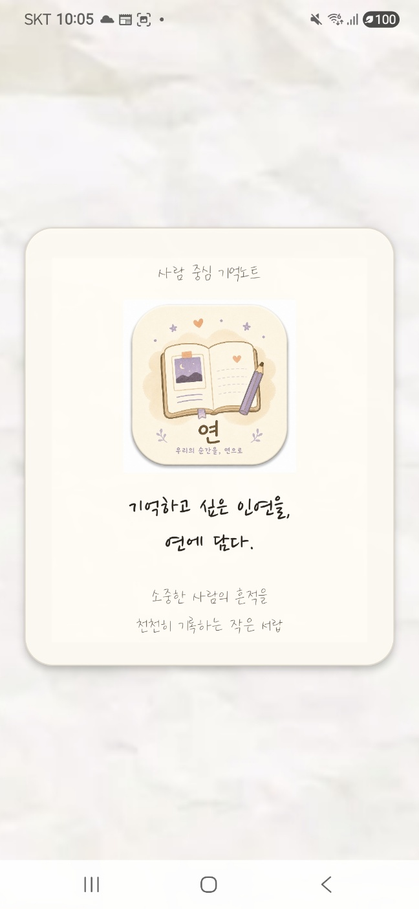
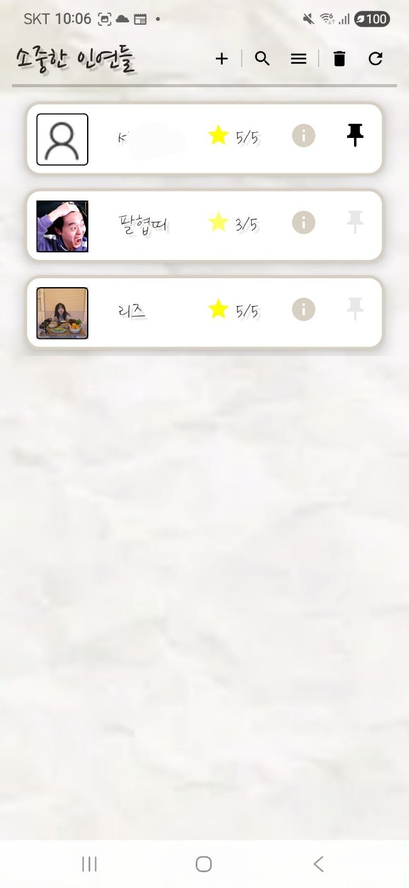
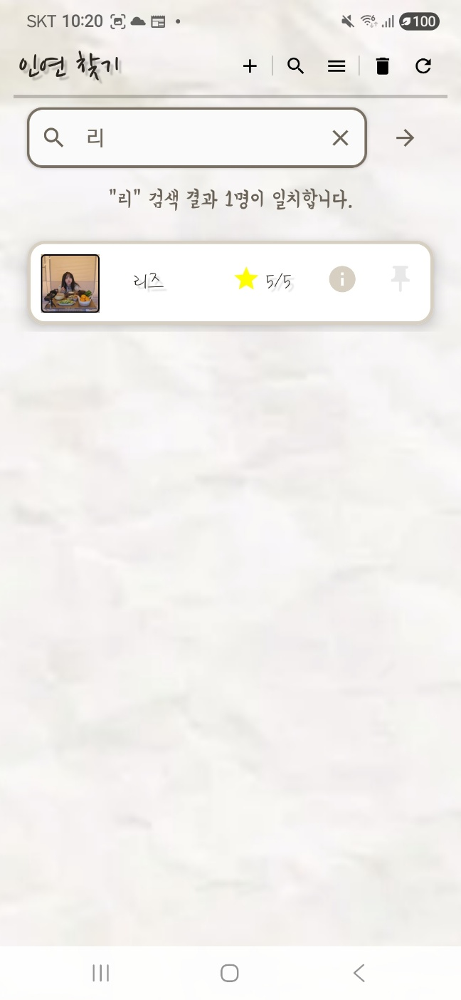
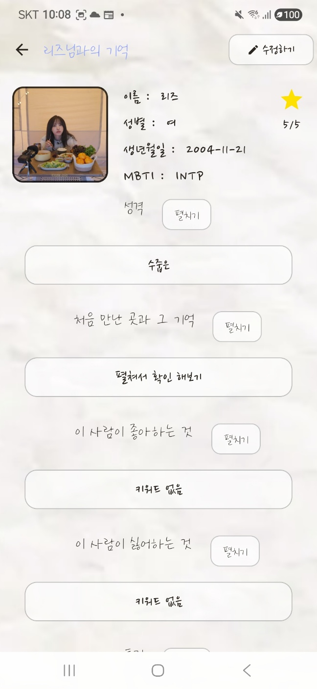
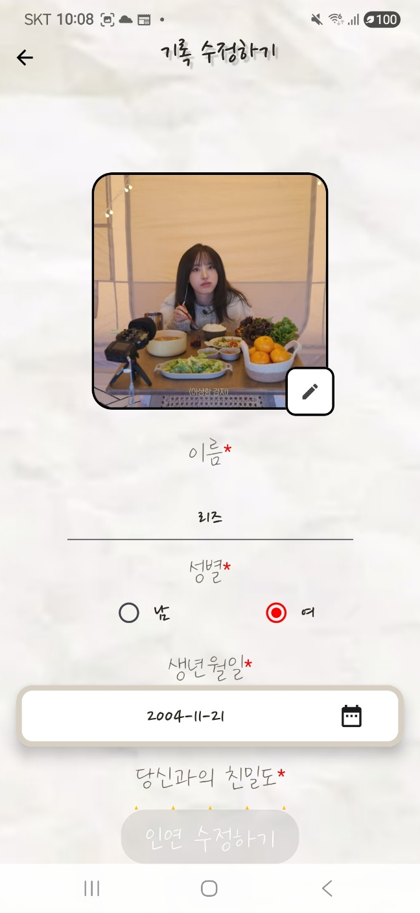
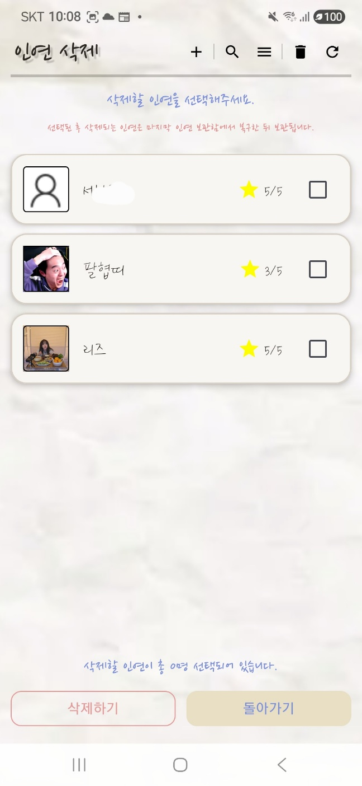
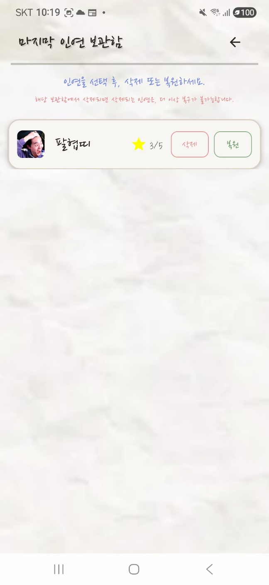

## 목차

1. 프로젝트 소개
2. 개발 목적
3. 주요 기능
4. 기술 스택
5. 아키텍처 및 패키지 구조
6. 핵심 구현 포인트
7. 화면 구성
8. 실행 환경
9. 향후 개선 사항

# 연(緣)
사람 중심 기억노트, 소중한 인연의 정보와 기억을 기록하는 Android 로컬 앱입니다.

## 프로젝트 소개

연(緣)은 소중한 사람과의 관계, 기억, 취향, 대화, 사진을 기록하고 다시 돌아볼 수 있도록 만든 Android 로컬 기록 앱입니다.

단순히 사람의 연락처를 저장하는 것이 아니라, 한 사람과의 관계 속에서 기억하고 싶은 순간과 정보를 함께 남기는 것을 목표로 합니다. 사용자는 인연의 기본 정보, 만남의 기억, 좋아하는 것과 싫어하는 것, 특징, 최근 대화, 사진, 메모 등을 기록할 수 있습니다.

외부 서버 없이 Room 기반 로컬 데이터베이스로 동작하며, 개인적인 관계 정보를 사용자의 기기 안에서 관리하도록 설계했습니다.

## 주요 기능

### FR-01. 인연 추가

- 이름, 성별, 생년월일, 친밀도, MBTI, 성격 등 기본 정보를 입력할 수 있습니다.
- 처음 만난 날, 처음 만난 장소, 좋아하는 것, 싫어하는 것, 특징, 메모 등 관계에 대한 세부 정보를 기록할 수 있습니다.
- 프로필 이미지와 함께한 사진을 등록하여 사람과의 기억을 시각적으로 남길 수 있습니다.
- 필수 입력값 검증과 저장하지 않은 입력값에 대한 이탈 확인 처리를 제공합니다.

### FR-02. 인연 열람

- 등록된 인연 목록을 카드 형태의 목록으로 확인할 수 있습니다.
- 이름 기반 검색 기능을 통해 원하는 인연을 빠르게 찾을 수 있습니다.
- 최신순, 오래된순, 친밀도순, 이름순 정렬을 지원합니다.
- 중요한 인연은 상단 고정 기능을 통해 목록 위쪽에 표시할 수 있습니다.
- 목록에서 1차로 확장해 간단한 추가정보를 확인하고, 버튼을 통해 별도 준비된 상세 화면에서 더 많은 정보를 열람할 수 있습니다.
- 삭제된 인연은 휴지통에서 확인할 수 있으며, 복원 또는 영구 삭제할 수 있습니다.

### FR-03. 인연 수정

- 기존에 등록한 인연 정보를 수정할 수 있습니다.
- 인연 추가 화면의 입력 구조를 재사용하여 일관된 수정 입력 경험을 제공합니다.
- 수정 완료 후 상세 화면과 목록 화면에 변경된 정보가 반영됩니다.
- 저장하지 않은 수정 내용이 있을 경우 이탈 확인 처리를 제공합니다.

### FR-04. 보안 및 접근 제어

- 전화번호, 거주지, SNS 등 민감 정보는 기본적으로 마스킹 처리됩니다.
- 자물쇠 버튼을 통해 기기 인증을 수행한 뒤 민감 정보를 확인할 수 있습니다.
- 수정 화면 진입 전에도 기기 인증을 요구하여 개인 기록 데이터 접근을 보호합니다.
- 사용자의 기기에 등록된 지문, 얼굴 인식, PIN, 패턴, 비밀번호 인증 방식을 활용합니다.

## 기술 스택

| 분류 | 기술 |
|---|---|
| Language | Kotlin |
| UI | Jetpack Compose, Material 3 |
| Architecture | MVVM, Clean Architecture 기반 계층 분리 구조 |
| State Management | UiState / UiEvent / Effect, StateFlow |
| Async | Kotlin Coroutine, Flow |
| Dependency Injection | Hilt |
| Local Database | Room, DAO, Entity, TypeConverter |
| Design Pattern | Repository Pattern, UseCase |
| Security | AndroidX Biometric |
| Image / Resource | Android Photo Picker, 내부 저장소 기반 이미지 URI 관리 |
| Version Control | Git, GitHub |

본 프로젝트는 MVVM 구조를 기반으로 Presentation / Domain / Data 계층을 분리하여 구현했습니다.

Presentation 계층에서는 Jetpack Compose Screen과 ViewModel이 화면 상태를 관리하며, UiState / UiEvent / Effect 구조를 통해 단방향 상태 흐름을 구성했습니다.

Domain 계층에서는 UseCase와 Repository Interface를 통해 기능 단위의 비즈니스 흐름을 분리했습니다.

Data 계층에서는 Room DAO, Entity, RepositoryImplementation, Mapper를 통해 로컬 데이터 저장과 변환을 담당하도록 구성했습니다.

## 아키텍처 및 패키지 구조

본 프로젝트는 MVVM 구조를 기반으로 Presentation / Domain / Data 계층을 분리하여 구현했습니다.

Presentation 계층에서는 Jetpack Compose Screen과 ViewModel이 화면 상태를 관리하며, UiState / UiEvent / Effect 구조를 통해 단방향 상태 흐름을 구성했습니다.

Domain 계층에서는 UseCase와 Repository Interface를 통해 기능 단위의 비즈니스 흐름을 분리했습니다.

Data 계층에서는 Room Entity, DAO, RepositoryImpl, Mapper를 통해 로컬 데이터 저장과 변환을 담당하도록 구성했습니다.

```text
com.example.project_yeon
├── app
│   └── navigation
│       └── 앱 화면 이동 경로 및 NavHost 관리
│
├── core
│   ├── common
│   │   └── 공통 결과 처리, 에러 처리 등 공통 로직
│   └── ui
│       └── 공통 UI 컴포넌트, 테마, 입력 필드, 다이얼로그 관리
│
├── data
│   ├── local
│   │   └── Room Database, DAO, Entity, TypeConverter
│   ├── person
│   │   └── PersonRepositoryImpl 등 인연 데이터 처리 구현체
│   └── security
│       └── 기기 인증 등 보안 관련 구현
│
├── di
│   └── Hilt 기반 의존성 주입 모듈
│
├── domain
│   ├── person
│   │   └── 인연 관련 Domain Model, Repository Interface, UseCase
│   └── security
│       └── 보안 관련 Repository Interface
│
└── feature
    └── person
        ├── add
        │   └── 인연 추가 화면
        ├── list
        │   └── 인연 목록, 검색, 정렬, 삭제 모드 화면
        ├── detail
        │   └── 인연 상세 화면 및 민감 정보 열람
        ├── modify
        │   └── 인연 수정 화면
        ├── splash
        │   └── 앱 진입 Splash 화면
        └── trash
            └── 삭제된 인연 보관함, 복원, 영구 삭제 화면
```
### 계층별 역할

| 계층 | 역할 |
|---|---|
| Presentation | Jetpack Compose Screen, ViewModel, UiState, UiEvent, Effect를 통해 화면 상태와 사용자 이벤트를 관리합니다. |
| Domain | UseCase와 Repository Interface를 통해 기능 단위의 비즈니스 흐름을 정의합니다. |
| Data | Room DB, DAO, Entity, RepositoryImpl, Mapper를 통해 실제 로컬 데이터 저장과 변환을 처리합니다. |
| Core | 여러 화면에서 재사용되는 공통 UI 컴포넌트, 테마, 입력 필드, 다이얼로그, 공통 결과/에러 처리를 관리합니다. |
| DI | Hilt를 사용하여 Repository, DAO, UseCase, Database 등의 의존성 주입을 관리합니다. |

## 핵심 구현 포인트

### 1. UiState / UiEvent / Effect 기반 단방향 상태 흐름

각 화면은 ViewModel을 중심으로 상태를 관리하며, 화면 상태는 UiState, 사용자 입력은 UiEvent, 일회성 동작은 Effect로 분리했습니다.

이를 통해 저장, 수정, 삭제, 복원, 보안 인증과 같은 기능 흐름을 예측 가능한 단방향 구조로 처리했습니다.

- UiState: 화면에 표시되는 상태 관리
- UiEvent: 사용자 입력 및 화면 이벤트 처리
- Effect: 화면 이동, Snackbar, 기기 인증 요청 등 일회성 동작 처리

### 2. Room 기반 로컬 데이터 관리

외부 서버 없이 Room Database를 사용하여 인연 데이터를 로컬에 저장했습니다.

PersonEntity를 중심으로 인연의 기본 정보, 관계 정보, 사진 URI, 메모 등을 관리하며, DAO와 Repository를 통해 데이터 접근 책임을 분리했습니다.

### 3. 삭제 / 복원 가능한 휴지통 구조

인연 삭제 시 데이터를 즉시 제거하지 않고 HiddenPersonEntity로 이동시키는 휴지통 구조를 구현했습니다.

삭제 시 PersonEntity 전체를 JSON으로 직렬화하여 보관하고, 복원 시 해당 데이터를 다시 PersonEntity로 되돌리는 방식으로 삭제 전 상태를 최대한 유지하도록 구성했습니다.

이를 통해 사용자가 실수로 삭제한 인연도 복원할 수 있는 안전한 데이터 흐름을 제공했습니다.

### 4. 인연 추가 / 수정 입력 구조 재사용

FR-01 인연 추가 화면과 FR-03 인연 수정 화면은 유사한 입력 구조를 가지므로, 입력 필드와 다이얼로그, 이미지 선택 컴포넌트 등을 공통화하여 재사용했습니다.

수정 화면에서는 기존 데이터를 초기값으로 표시하고, 사용자가 변경한 값을 저장하는 방식으로 Add와 Modify의 기능 차이를 유지하면서도 UI 일관성을 확보했습니다.

### 5. 기기 인증 기반 민감 정보 보호

전화번호, 거주지, SNS와 같은 민감 정보는 기본적으로 마스킹 처리했습니다.

사용자가 자물쇠 버튼을 누르면 AndroidX Biometric 기반 기기 인증을 요청하고, 인증에 성공한 경우에만 민감 정보를 언마스킹하도록 구현했습니다.

또한 수정 화면 진입 전에도 기기 인증을 요구하여 개인 기록 데이터에 대한 접근 제어를 강화했습니다.

### 6. 프로젝트 전용 UI 스타일 구성

앱의 콘셉트인 “사람 중심 기억노트”에 맞춰 종이 배경, 손글씨 폰트, 노트형 SplashScreen, 커스텀 입력 Dialog, 앱 아이콘 등을 적용했습니다.

기본 Material 컴포넌트를 그대로 사용하기보다, 프로젝트 분위기에 맞는 UI 컴포넌트로 조정하여 앱 전체의 시각적 일관성을 높였습니다.

전체적으로 기능 구현뿐 아니라 상태 관리, 데이터 생명주기, 보안 접근 제어, UI 일관성을 함께 고려하여 MVP 앱의 완성도를 높이는 데 집중했습니다.

## 화면 구성

앱의 주요 화면과 기능 흐름은 다음과 같습니다.

| Splash(앱 실행 직후) |
|---|
|  |

| 기본 목록 | 검색하기 |
|---|---|
|  |  |

| 상세정보 화면 | 수정하기 |
|---|---|
|  |  |

| 삭제 하기 | 휴지통 & 복원하기 |
|---|---|
|  |  |

## 실행 환경

본 프로젝트는 Android Studio 환경에서 Kotlin과 Jetpack Compose를 기반으로 개발되었습니다.

| 항목 | 내용 |
|---|---|
| IDE | Android Studio |
| Language | Kotlin |
| UI Framework | Jetpack Compose |
| Min SDK | Android 13, API 33 |
| Target SDK | 프로젝트 설정 기준 |
| Database | Room |
| Dependency Injection | Hilt |
| Build System | Gradle |

## 향후 개선 예정 사항

### 1. Detail 화면 스크린샷 차단 옵션 검토

민감 정보가 언마스킹된 상태에서 화면 캡처로 저장될 수 있는 가능성을 고려하여, DetailPersonScreen 진입 중 `FLAG_SECURE`를 적용하는 방안을 검토할 예정입니다.

### 2. 반응형 UI 고도화

현재는 모바일 세로 화면을 중심으로 UI를 구성했으며, 향후 태블릿 및 다양한 화면 크기에서도 자연스럽게 보이도록 WindowSizeClass 기반 반응형 UI를 보강할 예정입니다.

### 3. 테스트 코드 보강

현재는 실기기 테스트 중심으로 기능을 검증했으나, 향후 ViewModel 단위 테스트와 UseCase 테스트를 추가하여 기능 안정성을 높일 예정입니다.

### 4. 데이터 백업 및 내보내기 기능 검토

현재 앱은 로컬 저장소 기반으로 동작하지만, 사용자가 기기를 변경하거나 데이터를 보관하고 싶은 상황을 고려하여 JSON 내보내기 또는 로컬 백업 기능을 검토할 예정입니다.
